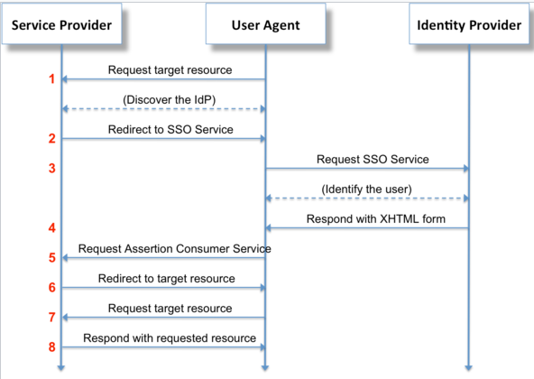

# Identity Management
Users of distributed systems interact with a variety of services, which need to authenticate their identity. 
Malicious users are also trying to get access to these same services, and need to be denied access.
Identity management which discriminated between valid and malicious users is an important part
of securing distributed systems. 

## Identity and Access Management (IAM)
Identity and Access Management (IAM) describes the set of technologies needed to insure access to
technology resources only by valid users, while blocking access to malicious uses.

### Role-based Access Management (RBAM)
Role-based access management describes the process of defining roles (e.g. system administrator, database administrator,
developer, etc.) that describe a class of users, then providing needed resource access that is common this class of user.

Setting up AIM roles for a large distributed system while minimizing access for each user is fairly complex,
and results in a large number of roles being defined. This approach results in on-going role maintenance 
as the distributed system evolves and users find they don't have adequate permissions to all of the system resources 
that they need access to.

### Attribute-Based Access Management (ABAM)

### Amazon IAM
Amazon IAM is often the basis of comparison for IAM systems, due to the dominance AWS in cloud computing.
Amazon uses role-based access management for many network functions.

Some [example IAM policies](https://docs.aws.amazon.com/IAM/latest/UserGuide/access_policies_examples.html) include:
* Allow access during a specific range of dates
* Allows enabling and disabling AWS Regions
* Allows MFA-authenticated users to manage their own credentials
* Allows access to a specific Amazon DynamoDB table
* Denies access to data pipelines that a user did not create

AWS limits AWS accounts to 1,000 roles (although an increase in roles can be requested), which places
some limit on how fine-grained AIM access permissions can be.

### Golang Access Control Policies Implementation
[`Landon`](https://github.com/ory/ladon) is an access control policy implementation written in Go which is 'inspired by AWS' policies,
but provides much finer-grained control of permissions. `Landon` controls 'who is able to do what' based on:
* **Who**: Subject name, for example "Bill"
* **Able**: "allow" or "deny" action
* **What**: Action such as "create" or "delete"
* **Something**: Arbitrary unique resource name, e.g. "Unique-resource-name"
* **Context**: Current context such resource owner, request date, IP Address, ...

An example of [creating an access policy](https://github.com/ory/ladon/blob/master/README.md) in Go is give on the Github project page:
```go
import "github.com/ory/ladon"

var pol = &ladon.DefaultPolicy{
	// A required unique identifier. Used primarily for database retrieval.
	ID: "68819e5a-738b-41ec-b03c-b58a1b19d043",

	// A optional human readable description.
	Description: "something humanly readable",

	// A subject can be an user or a service. It is the "who" in "who is allowed to do what on something".
	// As you can see here, you can use regular expressions inside < >.
	Subjects: []string{"max", "peter", "<zac|ken>"},

	// Which resources this policy affects.
	// Again, you can put regular expressions in inside < >.
	Resources: []string{
            "myrn:some.domain.com:resource:123", "myrn:some.domain.com:resource:345",
            "myrn:something:foo:<.+>", "myrn:some.domain.com:resource:<(?!protected).*>",
            "myrn:some.domain.com:resource:<[[:digit:]]+>"
        },

	// Which actions this policy affects. Supports RegExp
	// Again, you can put regular expressions in inside < >.
	Actions: []string{"<create|delete>", "get"},

	// Should access be allowed or denied?
	// Note: If multiple policies match an access request, ladon.DenyAccess will always override ladon.AllowAccess
	// and thus deny access.
	Effect: ladon.AllowAccess,

	// Under which conditions this policy is "active".
	Conditions: ladon.Conditions{
		// In this example, the policy is only "active" when the requested subject is the owner of the resource as well.
		"resourceOwner": &ladon.EqualsSubjectCondition{},

		// Additionally, the policy will only match if the requests remote ip address matches address range 127.0.0.1/32
		"remoteIPAddress": &ladon.CIDRCondition{
			CIDR: "127.0.0.1/32",
		},
	},
}


## Security Assertion Markup Language (SAML)
SAML is an identity federation standard, allowing third-party authentication of users or your server or allowing you to authenticate users or a third party.
SAML security assertions are defined in XML-based text.

The most important SAML application is for web browser single sign-on (SSO), extended across security domains.
The SAML protocol is illustrated here:

SAML 

An **Identity Provider** (IdP) is a service that authenticates users, and a **Service Provider** (SP) 
delegates authentication to an IdP. The user agent (e.g. web browser) makes a request to a service provider (e.g. web host),
which uses a SAML identity provider to authenticate the user. 

The service provider redirects requests from the user agent to the SSO of the users preferred identity provider.
The SSO service validates the user request, providing authorization with an XHTML document, which the user posts
to the service provider. These are front-channel exchanges, where the use communicates directly with the Service Provider
and Identity Provider. There is no back-channel exchange directly between the Service Provider and Identity Provider. 

### Step through SAML process
A useful approach to understand SAML interactions is to step through them manually.
**Onelogin** provides [SAML developer tools](https://www.samltool.com/sign_response.php) that 
allow you to manually set up SAML authentication:
* Edit a [sample SAML file] with NotBefore time, username, sitename
  * *XML* paste unsigned SAML response
* *Private key*: paste
* *X509 cert*: paste
* *Mode*: "Signed Assertion"
* click *sign XML*
* copy from *SignedXML* field
* [Base64 encoding](https://www.samltool.com/base64.php
)

### `saml` Go implementation
[GoDoc](https://godoc.org/) is a good place to look for the canonical implementation of Go functions.
The [`saml`](https://godoc.org/github.com/crewjam/saml) seems to be the most popular and best maintained library.
This documentation has been cleaned up somewhat in the [`go-saml`](https://godoc.org/github.com/edaniels/go-saml)
fork of `saml`. Package `saml` contains a partial implementation of the SAML standard. 

Each service provider must have an self-signed X.509 key pair established, which can be generated by:
```sh
openssl req -x509 -newkey rsa:2048 -keyout myservice.key -out myservice.cert -days 365 -nodes -subj "/CN=myservice.example.com"
```

Middleware provides an `http.Handler` to serve the SAML URLs and wrappers to require the user to be logged in. 
A URL must be provided where the service provider can get metadata from the **Identity Provider** (IDP).
```go
    package main

    import (
        "fmt"
        "io/ioutil"
        "net/http"

        "github.com/crewjam/saml/samlsp"
    )

    func hello(w http.ResponseWriter, r *http.Request) {
        fmt.Fprintf(w, "Hello, %s!", r.Header.Get("X-Saml-Cn"))
    }

    func main() {
        key, _ := ioutil.ReadFile("myservice.key")
        cert, _ := ioutil.ReadFile("myservice.cert")
        samlSP, _ := samlsp.New(samlsp.Options{
            IDPMetadataURL: "https://www.testshib.org/metadata/testshib-providers.xml",
            URL:            "http://localhost:8000",
            Key:            string(key),
            Certificate:    string(cert),
        })
        app := http.HandlerFunc(hello)
        http.Handle("/hello", samlSP.RequireAccount(app))
        http.Handle("/saml/", samlSP)
        http.ListenAndServe(":8000", nil)
    }
```

### `go-saml`
`go-saml` is another popular SAML Go library with (perhaps better) support for being an IdB.
For example, creating a SAML Response (if acting as an IdP):

```go
issuer := "http://localhost:8000/saml"
authnResponse := saml.NewSignedResponse()
authnResponse.Issuer.Url = issuer
authnResponse.Assertion.Issuer.Url = issuer
authnResponse.Signature.KeyInfo.X509Data.X509Certificate.Cert = stringValueOfCert
authnResponse.Assertion.Subject.NameID.Value = userIdThatYouAuthenticated
authnResponse.AddAttribute("uid", userIdThatYouAuthenticated)
authnResponse.AddAttribute("email", "someone@domain")
authnResponse.Assertion.Subject.SubjectConfirmation.SubjectConfirmationData.InResponseTo = authnRequestIdRespondingTo
authnResponse.InResponseTo = authnRequestIdRespondingTo
authnResponse.Assertion.Subject.SubjectConfirmation.SubjectConfirmationData.Recipient = issuer

// signed XML string
signed, err := authnResponse.SignedString("/path/to/private.key")

// or signed base64 encoded XML string
b64XML, err := authnResponse.EncodedSignedString("/path/to/private.key")

```

### `saml2`
[`saml2`](https://github.com/russellhaering/gosaml2) is another popular SAML Go library with support for Service Providers.
This Go library presently doesn't support *being* an Identity Provider, but does have excellent support for interacting
with these major Identity providers:
* Auth0
* Ipsilon
* Okta
* OneLogin
* Shibboleth
