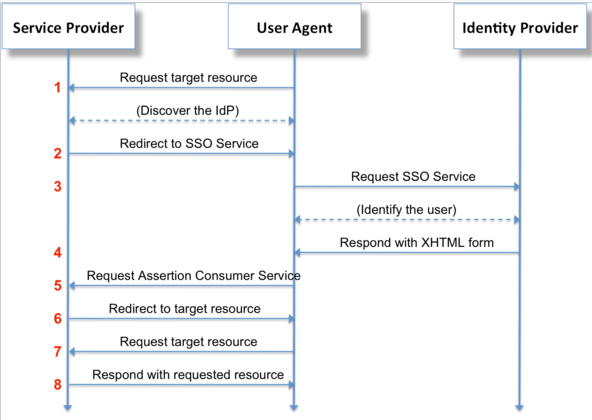

# Distributed System Design

Scaling of many web services tends to start at the same point (client requests handled by a single server),
unless there are strong redundancy or other reliability requirements.

The architecture of the web service and the path that web service scaling follows depends very strongly on the type of service,
for example read-heavy applications will often use a completely different database than write-heavy applications.


## Initial Implementation
The biggest risk to a companies success is that you haven't built something people want. Few companies
fail because they can't scale. 

Many successful web business still run on a single virtual private network (VPN), 
often using software designed for rapid development such as Rails or Django. 
Rails and Django tend to run slowly, but Rails/Django applications can scale 
to very high traffic levels by breaking out web services, 
which can be handled by a compiled language such as Go.


## Scaling to 10M users
Scaling of a high-volume web service tends end at the same point 
using every available method to improve availability and reliability.

* Stateless web servers and web services
* CDNs for static assets
* Caching for dynamic assets
* Horizontal Partitioning
  * Multiple servers
  * Database sharding
* Vertical Partitioning
  * Service oriented architecture
  * Message bus for connecting components
* Service Orchestration
* Multiple data centers
* Monitoring
* Security

Using a distributed architecture to build scalable cloud-based applications 
introduces many problems that need to be solved.

## Content Delivery Networks
One of the simplest scaling methods is to put static assets (such as photos and graphics) on a content delivery network,
which is a network of servers dedicated to supplying static assets.


## Caching


## Horizontal Partitioning

### Directory Partitioning
Hash values

### Database Partitioning (Sharding)
(replication)


## Vertical Partitioning

### Service Oriented Architecture

### Message Bus
Message bus components can combine the functions of load balancing, task assignment, heart beat for server monitoring, and data persistance.

RabbitMQ is easy to use for simple applications. Redis Queue is a commonly-used message bus for moderate load applications.
For high load applications, Kafka can scale to 100s of brokers and millions of messages per second with real time (~10 ms) latency. 
Kafka is used by [35% of Fortune 500 companies](https://opensourceunderdogs.com/episode-13-confluent-apache-kafka-streaming-with-jay-kreps), 
including AirBnB, LinkedIn, Netflix, and Uber.

AWS offers managed message services for applications scaling from very low volume to very high volume. [Kinesis]() is a full-function full function message bus similar to Kafka. For simpler requirements, AWS [SNS]() (Simple Notification Service) offers... 
AWS [SQS]() (Simple Queue Service) is a message queueing service that allows web service applications to send messages over a simple queue. 


## CAP Theorem
The [CAP theorem](https://mwhittaker.github.io/blog/an_illustrated_proof_of_the_cap_theorem/) says that is impossible for distributed systems to simultaneously achieve:
* Consistency
* Availability
* Partition tolerance (network partition due to communication failure)
simultaneously. 

Practical distributed systems need to be tolerant to message failures between partitions,
so in practice system design requires a choice between consistency (each request to the network producing the same answer)
and availability (always providing an answer to a data query).


## Consistent Hashing
[Consistent hashing](https://web.archive.org/web/20080721013638/http://www8.org/w8-papers/2a-webserver/caching/paper2.html)
is a way to distribute load across multiple servers and databases by generating a unique code hash tied to some fixed parameter of the service 
(for example user name), and dividing the range of possible hash codes into a fixed number of buckets equal to the number of available 
servers/database shards.

The problem with this hashing approach to distributing large amounts of user traffic is that using a fixed number of buckets makes it hard 
to scale the system. When the number of buckets N changes, a large amount of data needs to be shifted to maintain a consistent hashing scheme. 
Binary search is used to find the next node in a ring, leading to O(*log*(N)) complexity.


[*Rendezvous hashing*](https://ieeexplore.ieee.org/document/663936) allows for the more general case of selecting K out of N possibilities. 
Consistent hashing is the special case of rendezvous hashing where the number of selected options K=1.

Consistent hashing is used in distributed databases and document stores, including
* Cassandra
* Couchbase
* OpenStack
* Riak
as well as applications such as 
* Akamai
* Discord


## Jump hash table 
The consistent hashing scheme solves the problem of distributing workloads at the scale of most distributed applications. For large scale systems, synchronizing systems performing consistent hashing starts becoming inefficient. For a system where the load is distributed across 1000 systems, the consistent hashing scheme requires about 1000 table entries per system in order to equalize the traffic load per system within 3%. This results in several MByte of data per load balancer distributing traffic that must be synchronized reliably across the network as servers are added or go off-line due to system failures. A much more efficient way distributing traffic is with hashing bins generated using a pseudo-random function, where the only information that needs to be shared between systems is the number of hash partitions.

A [jump hash table](https://arxiv.org/ftp/arxiv/papers/1406/1406.2294.pdf) uses a pseudorandom code to generate hash bins that allows multiple systems to be synchronized without sharing a large amount of data between systems. This jump hash function is quite simple to implement:
```
int32_t JumpConsistentHash(uint64_t key, int32_t num_buckets) {
	int64_t b = -1, j = 0;
	while (j < num_buckets) {
		b = j;
		key = key * 2862933555777941757ULL + 1;
		j = (b + 1) * (double(1LL << 31) / double((key >> 33) + 1));
	}
	return b;
}
```
Hash bins generating using a jump hash table are more equal in size than if generated using consistent hashing method, so a smaller number of bins can be used resulting in faster sorting of hash values into system shards. Both the consistent hash and jump hash table require O(*log*(N)) complexity to convert the hash into a shard bin, However, the authors estimate that the jump hash table computation [runs about 5x faster](https://arxiv.org/ftp/arxiv/papers/1406/1406.2294.pdf) than the consistent hash method, due to fewer cache misses as a result of the jump hash method requiring less data for accurate computation.


## Sparse Distributed Hash Table
A [sparse distributed hash table](https://en.wikipedia.org/wiki/Distributed_hash_table) (DHT) uses a segmented keyspace 
(for example assigned by hashing a file) to store data, and an overlay network to determine where a key-value
pair should be stored, as well as where to retrieve it when requested.

Most distributed datastores use DHT for lookup. Other applications that use DHT include:
* BitTorrent DHT search engine
* JXTA, an open-source p2P platform

## Distributed Databases
Accessing and transmitting data efficiently is key to performance in high volume applications.
Optimum data storage depends on whether the data is highly structured, and whether the ...

* Cassandra: Replicates identical data across distributed nodes. Every node of a cluster is identical 
  * Cassandra AWS  managed service  [now in preview](https://aws.amazon.com/about-aws/whats-new/2019/12/announcing-amazon-managed-apache-cassandra-service-now-in-preview))
* Riak

### SQL vs NoSQL
The most common types of databases are based on Structured Query Language (SQL) access, where the data
is organized into tables of structured data, with records (rows) of data defined by fixed fields (columns)
with a defined data format (frequently with data in integer, float, or string format).

Non-SQL databases are frequently grouped together under the title `NoSQL`.

### Columnar Database
Columnar databases store SQL data in columnar order rather than row order,
which can make it faster to read out...

### Document Database
Document databases are designed for storing data as complete documents, 
rather than structured data in records and fields. Document databases include CouchDB.

### Graph Database

### Key-Value Store
Redis

### Wide-Column Database
Wide-column databases allow the names and formats of the columns to vary row by row, although typically
column families aure used where multiple columns are used together with multiple rows.

Googe Bigtable allows accessing wide-column databases with a row key, column key, and timestamp.
Wide-column databases such as Google BigTable are well suited to storing versioned web pages, where the
timestamp key is used to access different snapshots of the web page in time.
Google MapReduce is often used for generating data stored in Bigtable.

### Data Integrity
With distributed data, it is important to establish data integrity of large amounts of data stored in different locations.
A Merkle tree allows you to compare data sets without transfering large amounts of data, and to determine where in a data structure
the non-matching data is located. Distributed NoSQL databases that use Merkle trees include Cassandra and Riak


## Service Orchestration
Service orchestration...

### Hashicorp Nomad
Hashicorp Nomad is easy to use, and has the advantage of 
[very good integration](https://medium.com/@copyconstruct/schedulers-kubernetes-and-nomad-b0f2e14a896)
with Consul and Vault (which are also Hashicorp products).

### Kubernetes
Kubernetes is an enormously popular service orchestration software. Adoption since 2017 has been very rapid. 
Out of 8,000 attendees to Kubecon 2019, 73% were first-timers. 

Kubernetes can be very complex to run, and requires packaging your software in Docker containers which has
[potential reliability issues](https://medium.com/@copyconstruct/schedulers-kubernetes-and-nomad-b0f2e14a896)

* [Troubleshooting Kubernetes](https://learnk8s.io/troubleshooting-deployments):


## Monitoring
Distributed systems are far too complex at scale to monitor manually. Many software companies have developed
monitoring products to help with this task.

Monitoring systems are write-heavy; large amounts of data needs to be continually logged, but might only be analyzed
when there is a performance problem. For example, Facebook's Gorilla time series data base (TSDB) writes
[10's of millions of data points/sec](http://www.vldb.org/pvldb/vol8/p1816-teller.pdf), 
with a read rate that is orders of magnitude lower.

### Time Series Database
Network performance issues tend to emerge after a new software release, configuration change,
or network hardware failure. Data should be recorded with fine resolution to see changes
in performance immediately after a system change.

Grapha's Metrictank is a time series database modeled after Facebook's Gorilla TSDB.


## Cloud Security


## Cloud Services

### AWS
The edX 3-course series []() provides a good overview of AWS cloud services. The example in Course 1 covers EC2, S3, SNS () message bus, X-Ray...


## [Identity Management](#identity-management)
Users of distributed systems interact with a variety of services, which need to authenticate their identity. 
Malicious users are also trying to get access to these same services, and need to be denied access.
Identity management which discriminated between valid and malicious users is an important part
of securing distributed systems. 

Identity and Access Management (IAM) describes the set of technologies needed to insure access to
technology resources only by valid users, while blocking access to malicious uses.

### Role-based Access Management (RBAM)
Role-based access management describes the process of defining roles (e.g. system administrator, database administrator,
developer, etc.) that describe a class of users, then providing needed resource access that is common this class of user.

Setting up AIM roles for a large distributed system while minimizing access for each user is fairly complex,
and results in a large number of roles being defined. This approach results in on-going role maintenance 
as the distributed system evolves and users find they don't have adequate permissions to all of the system resources 
that they need access to.

### Attribute-Based Access Management (ABAM)

### Amazon IAM
Amazon IAM is often the basis of comparison for IAM systems, due to the dominance AWS in cloud computing.
Amazon uses role-based access management for many network functions.

Some [example IAM policies](https://docs.aws.amazon.com/IAM/latest/UserGuide/access_policies_examples.html) include:
* Allow access during a specific range of dates
* Allows enabling and disabling AWS Regions
* Allows MFA-authenticated users to manage their own credentials
* Allows access to a specific Amazon DynamoDB table
* Denies access to data pipelines that a user did not create

AWS limits AWS accounts to 1,000 roles (although an increase in roles can be requested), which places
some limit on how fine-grained AIM access permissions can be.

### Golang Access Control Policies Implementation
[`Landon`](https://github.com/ory/ladon) is an access control policy implementation written in Go which is 'inspired by AWS' policies,
but provides much finer-grained control of permissions. `Landon` controls 'who is able to do what' based on:
* **Who**: Subject name, for example "Bill"
* **Able**: "allow" or "deny" action
* **What**: Action such as "create" or "delete"
* **Something**: Arbitrary unique resource name, e.g. "Unique-resource-name"
* **Context**: Current context such resource owner, request date, IP Address, ...

An example of [creating an access policy](https://github.com/ory/ladon/blob/master/README.md) in Go is give on the Github project page:
```go
import "github.com/ory/ladon"

var pol = &ladon.DefaultPolicy{
	// A required unique identifier. Used primarily for database retrieval.
	ID: "68819e5a-738b-41ec-b03c-b58a1b19d043",

	// A optional human readable description.
	Description: "something humanly readable",

	// A subject can be an user or a service. It is the "who" in "who is allowed to do what on something".
	// As you can see here, you can use regular expressions inside < >.
	Subjects: []string{"max", "peter", "<zac|ken>"},

	// Which resources this policy affects.
	// Again, you can put regular expressions in inside < >.
	Resources: []string{
            "myrn:some.domain.com:resource:123", "myrn:some.domain.com:resource:345",
            "myrn:something:foo:<.+>", "myrn:some.domain.com:resource:<(?!protected).*>",
            "myrn:some.domain.com:resource:<[[:digit:]]+>"
        },

	// Which actions this policy affects. Supports RegExp
	// Again, you can put regular expressions in inside < >.
	Actions: []string{"<create|delete>", "get"},

	// Should access be allowed or denied?
	// Note: If multiple policies match an access request, ladon.DenyAccess will always override ladon.AllowAccess
	// and thus deny access.
	Effect: ladon.AllowAccess,

	// Under which conditions this policy is "active".
	Conditions: ladon.Conditions{
		// In this example, the policy is only "active" when the requested subject is the owner of the resource as well.
		"resourceOwner": &ladon.EqualsSubjectCondition{},

		// Additionally, the policy will only match if the requests remote ip address matches address range 127.0.0.1/32
		"remoteIPAddress": &ladon.CIDRCondition{
			CIDR: "127.0.0.1/32",
		},
	},
}
```

## Security Assertion Markup Language (SAML)
SAML is an identity federation standard, allowing third-party authentication of users or your server or allowing you to authenticate users or a third party.
SAML security assertions are defined in XML-based text.

The most important SAML application is for web browser single sign-on (SSO), extended across security domains.
The SAML protocol is illustrated here:

SAML 

An **Identity Provider** (IdP) is a service that authenticates users, and a **Service Provider** (SP) 
delegates authentication to an IdP. The user agent (e.g. web browser) makes a request to a service provider (e.g. web host),
which uses a SAML identity provider to authenticate the user. 

The service provider redirects requests from the user agent to the SSO of the users preferred identity provider.
The SSO service validates the user request, providing authorization with an XHTML document, which the user posts
to the service provider. These are front-channel exchanges, where the use communicates directly with the Service Provider
and Identity Provider. There is no back-channel exchange directly between the Service Provider and Identity Provider. 

### Step through SAML process
A useful approach to understand SAML interactions is to step through them manually.
**Onelogin** provides [SAML developer tools](https://www.samltool.com/sign_response.php) that 
allow you to manually set up SAML authentication:
* Edit a [sample SAML file] with NotBefore time, username, sitename
  * *XML* paste unsigned SAML response
* *Private key*: paste
* *X509 cert*: paste
* *Mode*: "Signed Assertion"
* click *sign XML*
* copy from *SignedXML* field
* [Base64 encoding](https://www.samltool.com/base64.php
)

### `saml` Go implementation
[GoDoc](https://godoc.org/) is a good place to look for the canonical implementation of Go functions.
The [`saml`](https://godoc.org/github.com/crewjam/saml) seems to be the most popular and best maintained library.
This documentation has been cleaned up somewhat in the [`go-saml`](https://godoc.org/github.com/edaniels/go-saml)
fork of `saml`. Package `saml` contains a partial implementation of the SAML standard. 

Each service provider must have an self-signed X.509 key pair established, which can be generated by:
```sh
openssl req -x509 -newkey rsa:2048 -keyout myservice.key -out myservice.cert -days 365 -nodes -subj "/CN=myservice.example.com"
```

Middleware provides an `http.Handler` to serve the SAML URLs and wrappers to require the user to be logged in. 
A URL must be provided where the service provider can get metadata from the **Identity Provider** (IDP).
```go
    package main

    import (
        "fmt"
        "io/ioutil"
        "net/http"

        "github.com/crewjam/saml/samlsp"
    )

    func hello(w http.ResponseWriter, r *http.Request) {
        fmt.Fprintf(w, "Hello, %s!", r.Header.Get("X-Saml-Cn"))
    }

    func main() {
        key, _ := ioutil.ReadFile("myservice.key")
        cert, _ := ioutil.ReadFile("myservice.cert")
        samlSP, _ := samlsp.New(samlsp.Options{
            IDPMetadataURL: "https://www.testshib.org/metadata/testshib-providers.xml",
            URL:            "http://localhost:8000",
            Key:            string(key),
            Certificate:    string(cert),
        })
        app := http.HandlerFunc(hello)
        http.Handle("/hello", samlSP.RequireAccount(app))
        http.Handle("/saml/", samlSP)
        http.ListenAndServe(":8000", nil)
    }
```

### `go-saml`
`go-saml` is another popular SAML Go library with (perhaps better) support for being an IdB.
For example, creating a SAML Response (if acting as an IdP):

```go
issuer := "http://localhost:8000/saml"
authnResponse := saml.NewSignedResponse()
authnResponse.Issuer.Url = issuer
authnResponse.Assertion.Issuer.Url = issuer
authnResponse.Signature.KeyInfo.X509Data.X509Certificate.Cert = stringValueOfCert
authnResponse.Assertion.Subject.NameID.Value = userIdThatYouAuthenticated
authnResponse.AddAttribute("uid", userIdThatYouAuthenticated)
authnResponse.AddAttribute("email", "someone@domain")
authnResponse.Assertion.Subject.SubjectConfirmation.SubjectConfirmationData.InResponseTo = authnRequestIdRespondingTo
authnResponse.InResponseTo = authnRequestIdRespondingTo
authnResponse.Assertion.Subject.SubjectConfirmation.SubjectConfirmationData.Recipient = issuer

// signed XML string
signed, err := authnResponse.SignedString("/path/to/private.key")

// or signed base64 encoded XML string
b64XML, err := authnResponse.EncodedSignedString("/path/to/private.key")

```

### `saml2`
[`saml2`](https://github.com/russellhaering/gosaml2) is another popular SAML Go library with support for Service Providers.
This Go library presently doesn't support *being* an Identity Provider, but does have excellent support for interacting
with these major Identity providers:
* Auth0
* Ipsilon
* Okta
* OneLogin
* Shibboleth
